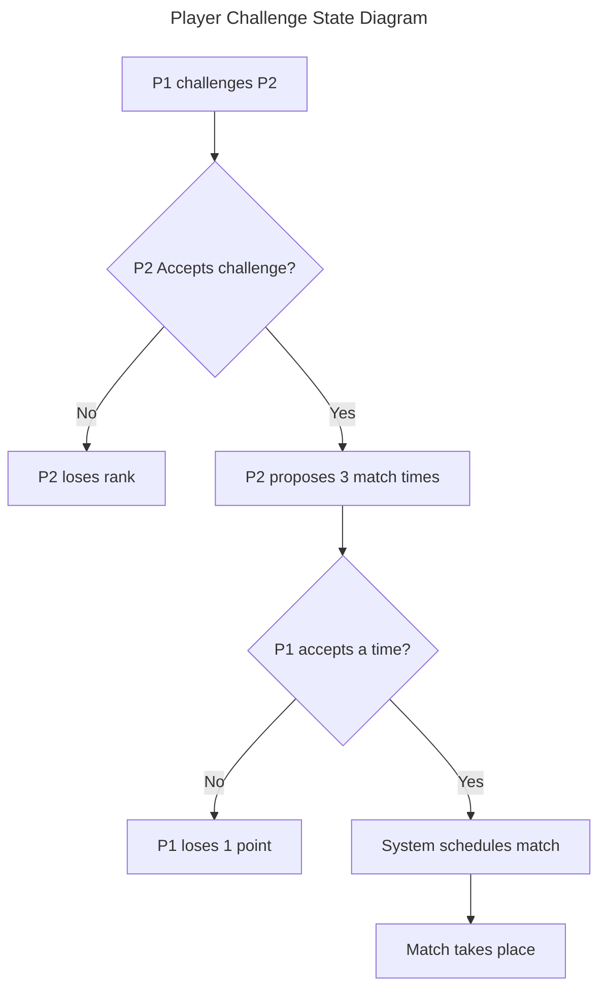

```mermaid
---
title: Player Challenge State Diagram
---

flowchart TD
    A[P1 challenges P2] --> B{P2 Accepts challenge?}
    B -- No --> C[P2 loses rank]
    B -- Yes --> D[P2 proposes 3 match times]
    D --> E{P1 accepts a time?}
    E -- No --> F[P1 loses 1 point]
    E -- Yes --> G[System schedules match]
    G --> H[Match takes place]

```