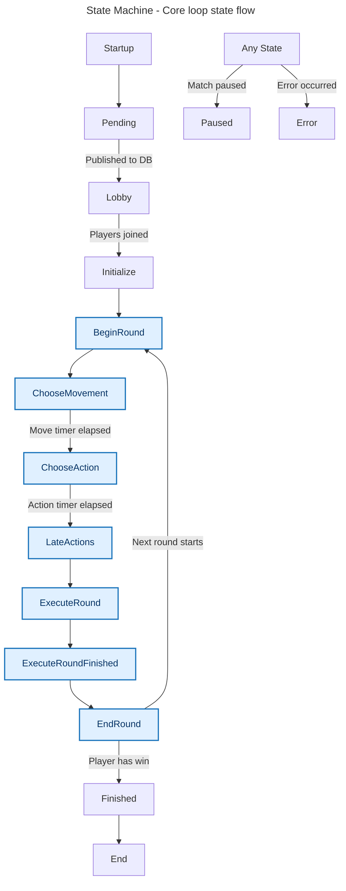

```mermaid
---
title: State Machine - Core loop state flow
---
flowchart TD
    classDef roundLoopStyle fill:#e0f0ff,stroke:#1c75bc,stroke-width:2px,color:#003366;

    A["Startup"] -->B["Pending"]
    B -->|Published to DB| C["Lobby"]
    C -->|Players joined| D["Initialize"]
    D -->E["BeginRound"]

    %% Round loop
    E -->F["ChooseMovement"]
    F -->|Move timer elapsed| G["ChooseAction"]
    G -->|Action timer elapsed| H["LateActions"]
    H -->I["ExecuteRound"]
    I -->J["ExecuteRoundFinished"]
    J -->K["EndRound"]
    K -->|Next round starts| E

    K -->|Player has win| L["Finished"]
    L --> M["End"]

    X["Any State"] -->|Match paused| N["Paused"]
    X -->|Error occurred| O["Error"]

    class E,F,G,H,I,J,K roundLoopStyle
```